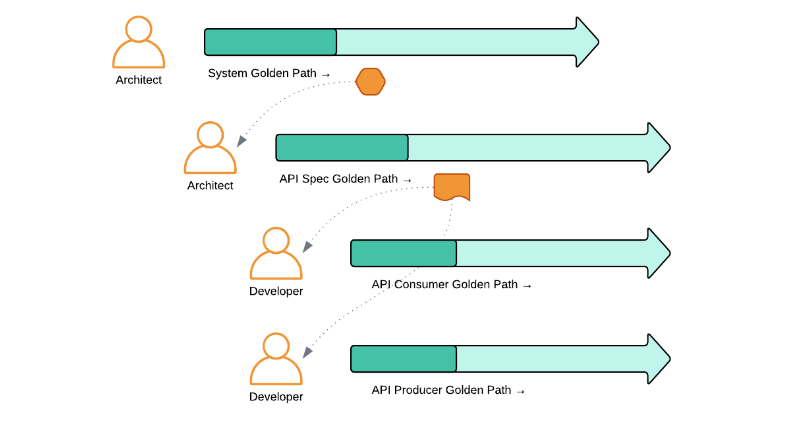
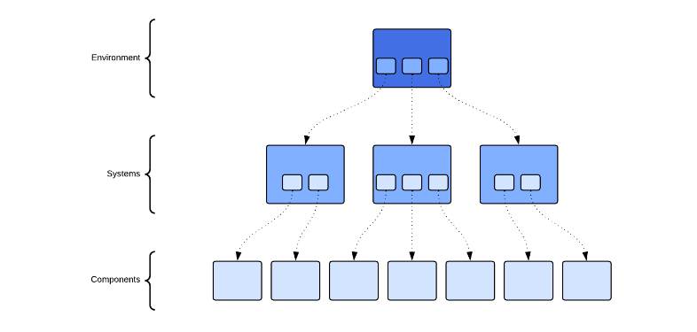

# Backstage Golden Path Software Templates

This is a collection of [Golden Path](https://www.redhat.com/en/blog/designing-golden-paths) templates which focus on contract-first development workflows. Contracts of many forms permeate Enterprise software landscapes, whether they are explicitly defined or not. Almost any integration between software components must include an understanding of the rules and conventions by which communication should take place. Contract-first development implies a an underlying development principle which says that a contract should be defined before implementation takes place. A contract-first approach often maximizes opportunities for implementation automation and can also create optimal conditions for parallel, autonomous workstreams, because the service provider implementing the contract and potentially multiple service consumers of the contract can be implemented without depending on each other. Ideally, the contract provides a complete understanding of both client and server-side expectations related to the communication channel.

## Proposed Golden Path Workflow

[Backstage uses a set of abstractions for its catalog](https://backstage.io/docs/features/software-catalog/system-model/) called _Entities_ to model an Enterprise software ecosystem. There are 3 core entity types: _Components_, _APIs_, and _Resources_. Sets of core entities that work together are grouped into _Systems_. _Systems_ can be grouped into _Domains_. This simple, yet flexible scheme for modeling a software ecosystem is usually adaptable to just about any Enterprise software landscape. The Golden Path Templates contained in this repository are built for the purpose of managing one of the described types of Backstage entities. Because the entity types have dependency relationships, there are some constraints in terms of the order in which new entities are onboarded.

The general proposed workflow for executing the Golden Path Templates is as follows:

## Golden Path Categories

The contained Golden Path Template examples generally fit into four categories, described below.

### System Golden Path

The System Golden Path template establishes a new Backstage _System_ to which APIs and Components can belong.

When using microservices-style architecture, typically, an application is composed of several software components. The Developer Hub should reflect these groupings of software components into larger applications. Backstage natively models a one-to-many relationship between Systems and Components. Architects will use this Golden Path to introduce a new System. This workflow is a place where resources which are shared by many or all components in a system, such as a namespace, can be automatically provisioned.

Backstage Golden Paths are driven by templates, but since a System itself is not usually a deployable software Component, System templates tend to focus on configuration for shared application platform dependencies as well as providing a link between software Components and environments. In a GitOps-driven environment, this tiered relationship between environments, systems, and components. There are several techniques for achieving this composition pattern with a GitOps scheme including ArgoCD “app of apps”, Helm umbrella charts, and Kustomize external resource references.

### API Specification Golden Path

Architects will use these Golden Paths to introduce a new _API_ entities and associate them with an existing _System_.

In order to encourage API-first or specification-first development, API specifications should have their own lifecycles, independent from any implementation of the specification. 

Note that the example templates promote the idea that even though an API specification itself is not a deployable software component in and of itself, an SDLC pipeline is still quite useful. An API specification pipeline provides a framework for API goverance enforcement via quality gates. A pipeline is also provides an execution environment for automation (especially automation that must be implemented with imperative procedures) such as API virtualization (automated API mock provisioning based on specification).

### API Consumer Golden Path

The API Consumer Golden Path introduces a new _Component_ which represents a client implementation of an API specification.

At the point when an API specification has been developed and published. API consumer and producer development can happen in any order or in parallel. However, in demonstration, development of a consumer prior to the development of a producer highlights an important freedom that is afforded by an API-first approach. By preconfiguring code generation tooling such as [OpenAPI Generator](https://openapi-generator.tech/), a developer can start development with a purpose-built client which is automatically compliant with the specification. If the API is virtualized, the client could potentially interact with the resulting API mock instance, faciliating integration tests without depending on the completion of an API server implementation.

### API Producer Golden Path

The API Consumer Golden Path introduces a new _Component_ which represents a server implementation of an API specification.

Again, by preconfiguring code generation tooling such as OpenAPI Generator, a developer can start development of an API producer with a generated server which is automatically compliant with the specification.
